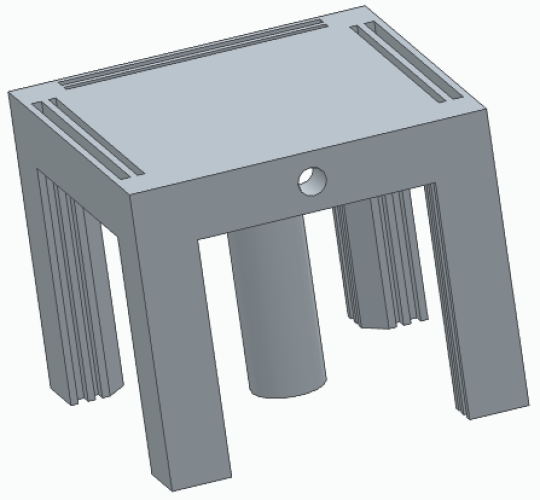
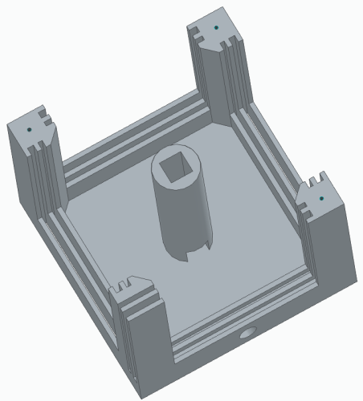
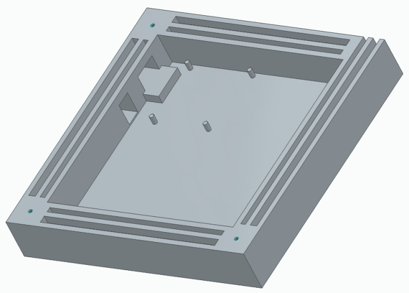

# 3D drawing of EO-Marker

# Table of contents

- [Top part](#top)
- [Bottom Part](#bottom)
- [Afmetingen](#afmetingen-metric)
- [Recommended Print Settings](#recommended-print-settings)

# Top

Dit is het hoofd gedeelte van de kubus. De sensor gaat in het gaatje vooraan met de kabels hiervan die door de cilinder gaan. Een reflecterende folie wordt aangebracht op deze cilinder. De ledstrips bevinden zich aan de schuine kant van de pillaren. Een difuser (plexiglas) wordt aangebracht in de verste gleuf en een triplex muurtje met of zonder de wegwijzing wordt aangebracht in de dichstbijzijnde gleuf.

# Bottom

Dit is de onderkant van de kubus. Hier komen de pcb en batterijhouder terecht. Deze worden vastgelijmd met hete lijm. Er is een gat voor een USB kabel als secondaire stroom en een gat voor de schakelaar. Deze 2 prints worden samen geschroefd met een M3 schroef of bout. De pcb wordt op de pins geschoven met de USB-C connector op het verhoogje. Links van de schakelaar, tegen de muur, wordt de batterijhouder vastgelijmd met een margin tussen de 2 muren, zodat deze kan opengemaakt worden.

# Afmetingen (metric)

De kubus gemonteerd is 150x150x150 mm groot. De muurtjes hebben een grootte van 109x109x3 mm, waarvan 100x100 mm zichtbaar is.

# Recommended print settings

- Material: PLA
- Resolution: 0.15 - 0.20
- Infill density: 10%
- Infill pattern: tri-hexagon
- Support: tree
- No adhesion