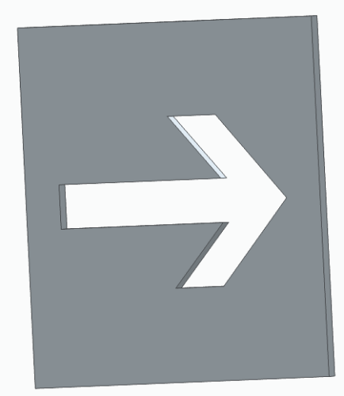

# 3D drawing of EO-Marker

# Table of contents

- [Top part](#top)
- [Bottom Part](#bottom)
- [Wall](#wall)
- [Afmetingen](#afmetingen-metric)
- [Recommended Print Settings](#recommended-print-settings)

# Top

This is the main part of the cube. The sensor goes into the hole at the front with its cables going through the cylinder. A reflective foil is applied to this cylinder. The LED strips are located on the sloping side of the pillars. A diffuser (plexiglass) is placed in the furthest slot and a plywood wall, with or without directions, is placed in the nearest slot.

# Bottom

This is the bottom of the cube. This is where the PCB and battery holder end up. These are glued in place with hot glue. There is a hole for a USB cable that functions as a secondary power and a hole for the switch. These 2 prints are screwed together with an M3 screw or bolt. The PCB is slid onto the pins with the USB-C connector on the platform. To the left of the switch, against the wall, the battery holder is glued with a margin between the 2 walls, so that it can be opened.

# Wall

This is the wall that blocks or allows light to pass through an arrow. This is laser cut from 3mm plywood. A reflective foil is also applied to this on the inside, so that the light can only escape through the arrow.

# Afmetingen (metric)

The cube assembled is 150x150x150 mm in size. The walls have a size of 109x109x3 mm, of which 100x100 mm is visible.

# Recommended print settings

- Material: PLA
- Resolution: 0.15 - 0.20
- Infill density: 10%
- Infill pattern: tri-hexagon
- Support: tree
- No adhesion