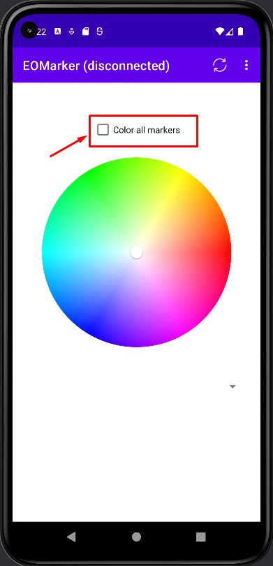

# The android app
## Table of contents

- [How to install](#how-to-install)
- [How to use](#how-to-use)

## How to install

1. Download the apk file from the [EOMarker_v1.0.apk](EOMarker_V1.0.apk).
2. Install the apk file on your android device.

## How to use

1. Open the app.
2. Go to settings and fill in the broker credentials.

3. When you've filled in the credentials save them by pressing the save button.

4. You should be redirected to the main menu and the status should now show connected instead of disconnected. 

5. Click the refresh button to discover the list of devices that are connected to the broker if available.

6. The dropdown menu should now be filled with the devices that are connected to the broker.

7. Go to options and select devices.

8. You should see a list of devices that are connected to the broker.
9. Click on the visualizer button to visualize the selected device or all devices.

10. In the main menu you can select a color and set it to the selected device or all devices by using the checkbox.

