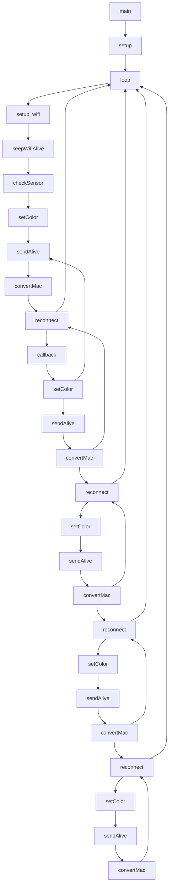

# arduino (esp32) firmware

## table of contents

- [Setup and configuration](#setup-and-configuration)
  - [Install environment](#install-environment)
  - [Configure config.h](#configure-configh)
- [Install](#install)
- [Usage](#usage)
- [Flowchart](#flowchart)


## Setup and configuration

Clone this repository and open it in vscode with platformio installed.

Open ./EOMarker_firm in vscode.

### Install environment

1. Install vscode
2. Install platformio
3. Select esp32 board

### Configure config.h

1. Copy `config.h.example` to `config.h`
2. Configure `config.h` with your wifi and mqtt settings

Example config.h:
```cpp
namespace EOMarker {
  namespace Config  {
    const char * WIFI_SSID = "SSID";
    //const char * WIFI_PASS = "PASSWORD";
    const char * MQTT_BROKER = "BROKER_URL";
    const char * MQTT_PASS = "BROKER_PASSWORD";
    const unsigned int MQTT_PORT = BROKER_PORT;
    const char * MQTT_BASE_TOPIC = "MQTT_TOPIC";
    const String LOGINS = "{'MAC-ADDRESS':'PASSWORD','MAC-ADDRESS2':'PASSWORD2'}";
  };
};
```

## Install

1. Connect esp32 to computer
2. Run `pio run -t upload`

## Usage

1. Connect esp32 to custom pcb
2. Turn on switch


# Flowchart

this is an attempt to visualize the flow of the program (not accurate) 





