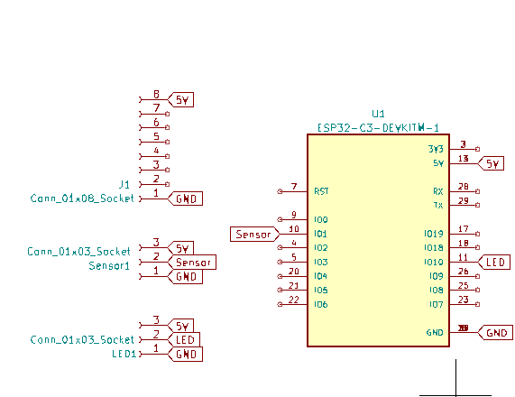
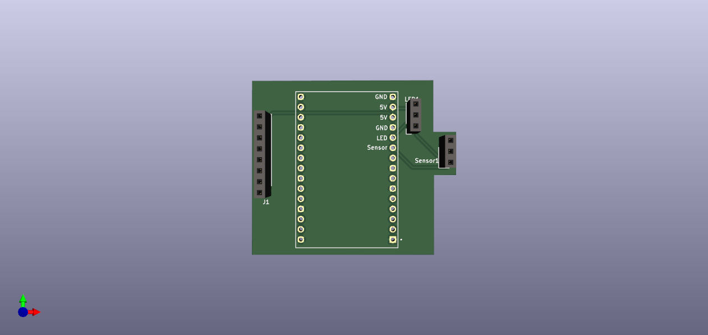
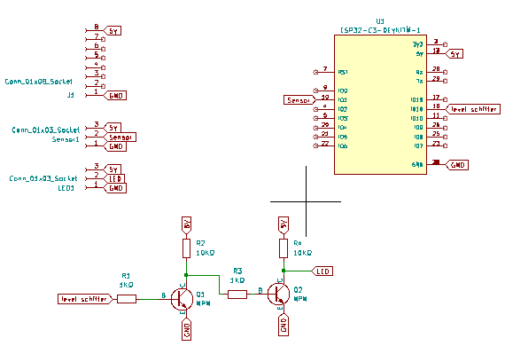
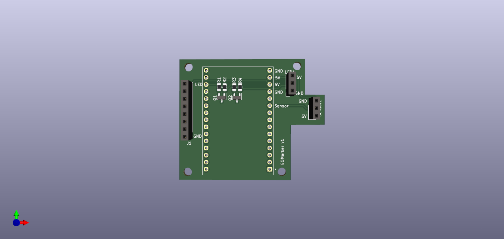

# PCB For EOMaker

## Important Note

Use PCB_ESP32-C3-DevKitM-1 or PCB_ESP32-C3-DevKitC-02
but the pinout is the ***not*** same for both!

Physical layout is the same but the pinout is different.

Make sure to use the right code for the right esp32-c3-devkit.

Pinout:

|component|ESP32-C3-DevKitM-1|ESP32-C3-DevKitC-02|
|---|---|---|
|LED|GPIO 18|GPIO 19|
|Sensor|GPIO 10|GPIO 8|


## Table of Contents

- [layout](#layout)
- [PCB](#pcb-deprecated)
- [PCB_ESP32-C3-DevKitM-1](#pcb_esp32-c3-devkitc-02)
- [PCB_ESP32-C3-DevKitC-02](#pcb_esp32-c3-devkitc-02)

## layout

```bash
.
├── README.md
├── pcb
├── PCB_ESP32-C3-DevKitM-1
├── PCB_ESP32-C3-DevKitC-02

```

## PCB DEPRECATED

First version of PCB for EOMaker
is only for ESP32-C3-DevKitM-1.

Schematic and PCB:





### BOM

| Part | Value | Package | Description |
| --- | --- | --- | --- |
| J1 | Conn_01x08_Socket | Connector_PinSocket_2.54mm:PinSocket_1x08_P2.54mm_Vertical | Generic connector, single row, 01x08, script generated |
| LED1 | Conn_01x03_Socket | Connector_PinSocket_2.54mm:PinSocket_1x03_P2.54mm_Vertical | Generic connector, single row, 01x03, script generated |
| Sensor1 | Conn_01x03_Socket | Connector_PinSocket_2.54mm:PinSocket_1x03_P2.54mm_Vertical | Generic connector, single row, 01x03, script generated |
| U1 | ESP32-C3-DEVKITM-1 | ESP32-C3-DEVKITM-1:XCVR_ESP32-C3-DEVKITM-1 |  |

## PCB_ESP32-C3-DevKitM-1





### bom PCB_ESP32-C3-DevKitM-1

| Part | Value | Package | Description |
| --- | --- | --- | --- |
| J1 | Conn_01x08_Socket | Connector_PinSocket_2.54mm:PinSocket_1x08_P2.54mm_Vertical | Generic connector, single row, 01x08, script generated |
| LED1 | Conn_01x03_Socket | Connector_PinSocket_2.54mm:PinSocket_1x03_P2.54mm_Vertical | Generic connector, single row, 01x03, script generated |
| Q1, Q2 | NPN | Package_TO_SOT_SMD:SOT-23 | Bipolar transistor symbol for simulation only, substrate tied to the emitter |
| R1, R3 | 1KΩ | Resistor_SMD:R_0805_2012Metric | Resistor |
| R2, R4 | 10KΩ | Resistor_SMD:R_0805_2012Metric | Resistor |
| Sensor1 | Conn_01x03_Socket | Connector_PinSocket_2.54mm:PinSocket_1x03_P2.54mm_Vertical | Generic connector, single row, 01x03, script generated |
| U1 | ESP32-C3-DEVKITM-1 | ESP32-C3-DEVKITM-1:XCVR_ESP32-C3-DEVKITM-1 |  |

## PCB_ESP32-C3-DevKitC-02


### bom PCB_ESP32-C3-DevKitM-02

| Part | Value | Package | Description |
| --- | --- | --- | --- |
| J1 | Conn_01x08_Socket | Connector_PinSocket_2.54mm:PinSocket_1x08_P2.54mm_Vertical | Generic connector, single row, 01x08, script generated |
| LED1 | Conn_01x03_Socket | Connector_PinSocket_2.54mm:PinSocket_1x03_P2.54mm_Vertical | Generic connector, single row, 01x03, script generated |
| Q1, Q2 | NPN | Package_TO_SOT_SMD:SOT-23 | Bipolar transistor symbol for simulation only, substrate tied to the emitter |
| R1, R3 | 1KΩ | Resistor_SMD:R_0805_2012Metric | Resistor |
| R2, R4 | 10KΩ | Resistor_SMD:R_0805_2012Metric | Resistor |
| Sensor1 | Conn_01x03_Socket | Connector_PinSocket_2.54mm:PinSocket_1x03_P2.54mm_Vertical | Generic connector, single row, 01x03, script generated |
| U1 | ESP32-C3-DEVKITC-02 | ESP32-C3-DEVKITC-02:XCVR_ESP32-C3-DEVKITC-02 |  |


