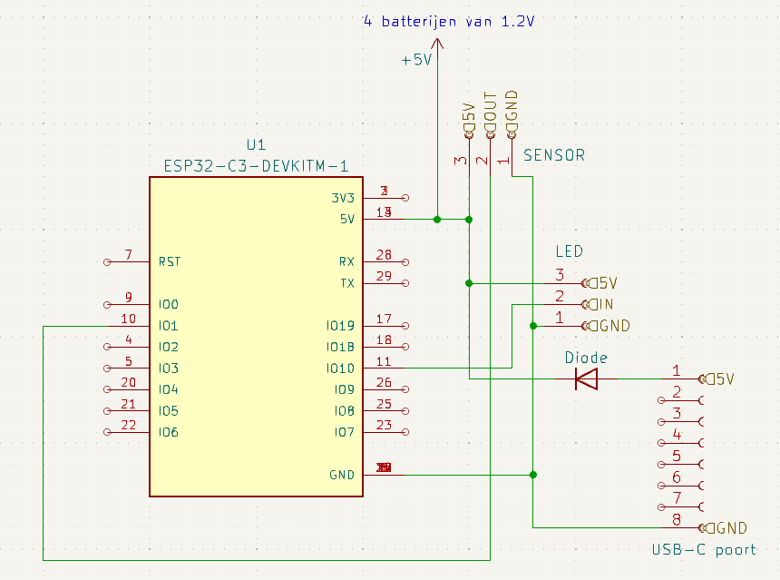

# **EO-Markers**

> Develop small standalone boxes that light up when someone approaches them.
> The boxes can be fitted with a plexi with Electronics-ICT and a
> direction indication via an arrow.

# Table of contents

- [Planning](#planning)
- [Canvas](#canvas)
- [Schakeling](#schakeling)
- [3D Tekening](#3d-tekening)
- [PCB](#pcb)

# Planning

- sprint 1 - Uitwerken concept & BOM lijst doorgeven voor bestellingen
- sprint 2 - Van prototype naar product
- sprint 3 - Product afwerken en test klaar maken
- sprint 4 - Debuggen, documenteren

# Canvas

# Schakeling

De schakeling bestaat uit 1 ESP, gevoed door een USB-kabel of een 5V batterij-pack (4 oplaadbare aa-batterijen). 3 female headers voor de ledstrips, 3 female headers voor de sensor, 8 female headers voor de USB-C poort en een diode voor stroom naar de batterijen tegen te houden.

# 3D Tekening 

Dit is het hoofd gedeelte van de kubus. De sensor gaat in het gaatje, de ledstrips gaan op de binnenkant van de palen en de kabels gaan door het middelste gedeelte. Een reflecterende folie wordt aangebracht op de middelste cilinder. Een difuser (plexiglas) wordt aangebracht in de verste gleuf en een triplex muurtje met of zonder de wegwijzing wordt aangebracht in de dichstbijzijnde gleuf.

Dit is de onderkant van de kubus. Hier komt de pcb, batterijhouder en kabels terecht. Er is een gat voor een USB kabel als secondaire stroom. Deze 2 prints worden tesamen geschroefd met een M3 schroef of bout.

# PCB

De PCB is gewoon een paar connectoren voor de ESP, LED-strip, de Sensor, USB-C poort en een level-stack. Hierop worden female pinheaders gesoldeerd. De connectoren zijn intern verbonden op de pcb. 

