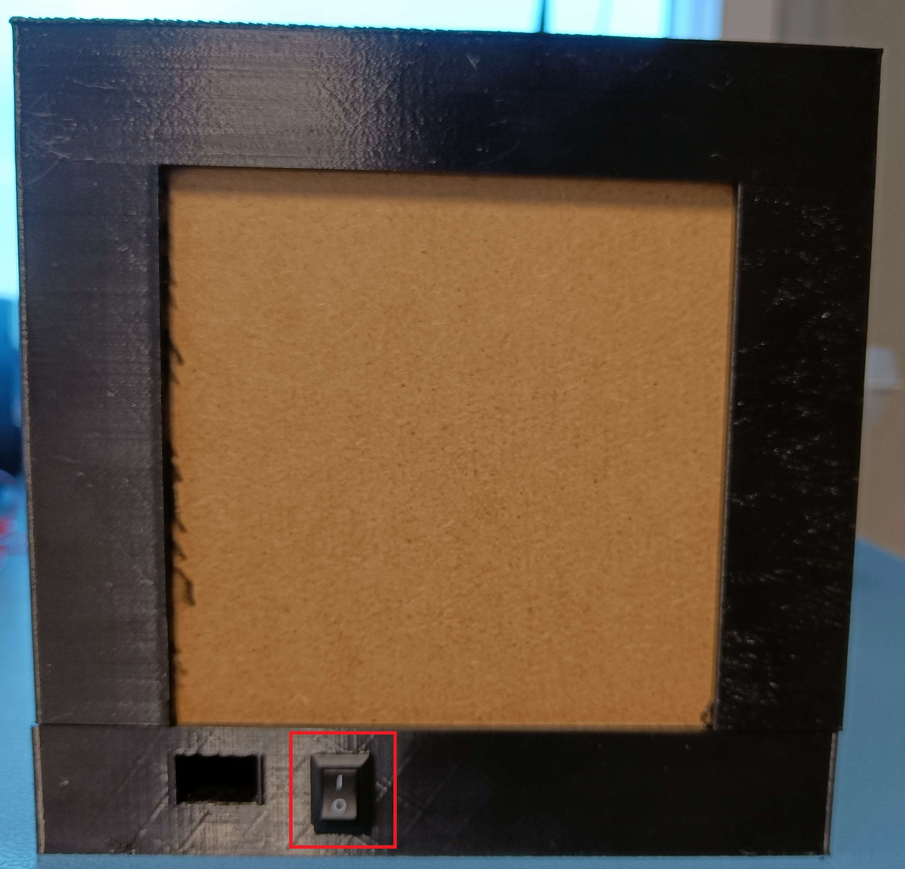
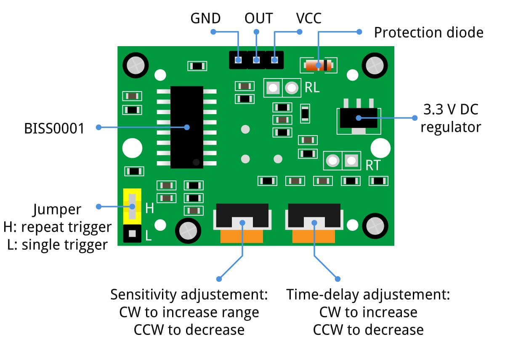

# **EO-Markers**

> Develop small standalone boxes that light up when someone approaches them.
> The boxes can be fitted with a plexi with Electronics-ICT and a
> direction indication via an arrow.

# Layout Github Repo

```bash
.
├── 3d tekening
│   ├── 3D_Bottom.png
│   ├── 3D_Main.png
│   └── README.md
├── Affiche
│   └── EO Markers Affiche.png
├── AndroidStudio
│   ├── EO-Markers
│   │   └── app
│   └── README.md
├── Arduino
│   ├── EO-Markers
│   │   ├── EO-Markers.cpp
│   │   └── EXAMPLE-config.h
│   └── README.md
├── img
│   ├── qr.png
│   └── project_canvas.png
│   └── potentiometers.jpg
│   └── schakelaar.jpg
├── PCB
│   ├── PCB
|   ├── PCB_ESP32-C3-DevKitM-1
│   ├── PCB_ESP32-C3-DevKitC-02
│   └── README.md
└── readme.md
```

# Table of contents

- [Planning](#planning)
- [Canvas](#canvas)
- [Affiche](#affiche)
- [How to use](#how-to-use)
- [3D Tekening](#3d-drawing)
- [Android Studio](#android-studio)
- [Arduino](#arduino)
- [PCB](#pcb)


# Planning

- sprint 1 - Uitwerken concept & BOM lijst doorgeven voor bestellingen
- sprint 2 - Van prototype naar product
- sprint 3 - Product afwerken en test klaar maken
- sprint 4 - Debuggen, documenteren

# Canvas


# Affiche


# How to use

1. It is important that the batteries are fully charged, as they are rechargeable. A USB-C port is provided as an alternative power supply.
2. Turn the switch on.



3. Wait about 10 seconds. The LED strips will then light up whenever the sensor, attached to the front of the marker, detects movement.
4. You can change the distance at which the sensor detects movement and the duration of lighting by turning the potentiometers as shown in the image.



5. Each time the light goes out, there is a period of 2.5 seconds before the sensor can detect movement again.
6. After using the EO marker, switch it off and charge the batteries.

# 3D drawing 

more info: [3D Tekening](./3d%20tekening/readme.md)

This is the base of the cube. The sensor is placed in the small round hole, the LED strips stick to the inside of the posts and the cables are inserted through the middle part. A reflective film has been applied to this area, which helps to spread the light around. A diffuser (plexiglass) is slid into the furthest slot and a plywood wall, with or without directions, is placed in the nearest slot.


This is the bottom of the cube. This is where the PCB, battery holder and cables end up. A hole is provided for a USB cable as secondary power. These 2 prints are screwed together with an M3 screw or bolt.


# Android Studio

more info: [Android Studio](./AndroidStudio/README.md)

# Arduino

more info: [Arduino](./Arduino/README.md)

# PCB

more info: [PCB](./PCB/README.md)

## PCB print

The PCB consists of a pair of connectors for the ESP, LED strip, sensor and USB-C port. These are female headers, so they fit in perfectly. The connectors are internally connected on the PCB. 


## PCB schematic

The circuit consists of 1 ESP, powered by a USB cable or a 5V battery pack connected in parallel on the j1 connector with a diode from battery pack to connector (4 rechargeable AA batteries). 3 female headers for the LED strips, 3 female headers for the sensor, 8 female headers for the USB-C port and a diode to stop current to the batteries.

Measurements:
U LED-strips (off): 4,1V;
U LED-strips (on): 3,1V

U Batteries (leds off): 4.9V;
U Batteries (leds on): 4.3V

U Diode (leds off): 0.72V;
U Diode (leds on): 0.86V

U Sensor (leds off): 2.98V;
U Sensor (leds on): 2.55V

U ESP (leds off): 4.1V;
U ESP (leds on): 3.45V


