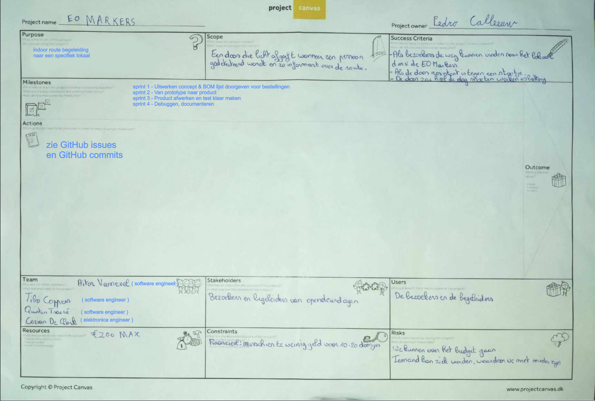

# **EO-Markers**

> Develop small standalone boxes that light up when someone approaches them.
> The boxes can be fitted with a plexi with Electronics-ICT and a
> direction indication via an arrow.

# layout github repo

```bash
.
├── 3d tekening
│   ├── 3D_Bottom.png
│   ├── 3D_Main.png
│   └── README.md
├── Affiche
│   └── EO Markers Affiche.png
├── AndroidStudio
│   ├── EO-Markers
│   │   └── app
│   └── README.md
├── Arduino
│   ├── EO-Markers
│   │   ├── EO-Markers.cpp
│   │   └── EXAMPLE-config.h
│   └── README.md
├── img
│   ├── qr.png
│   └── project_canvas.png
├── PCB
│   ├── PCB
|   ├── PCB_ESP32-C3-DevKitM-1
│   ├── PCB_ESP32-C3-DevKitC-02
│   └── README.md
└── readme.md
```

# Table of contents

- [Planning](#planning)
- [Canvas](#canvas)
- [3D Tekening](#3d-drawing)
- [Affiche](#affiche)
- [Android Studio](#android-studio)
- [Arduino](#arduino)
- [PCB](#pcb)


# Planning

- sprint 1 - Uitwerken concept & BOM lijst doorgeven voor bestellingen
- sprint 2 - Van prototype naar product
- sprint 3 - Product afwerken en test klaar maken
- sprint 4 - Debuggen, documenteren

# Canvas



# 3D drawing 

more info: [3D Tekening](./3d%20tekening/readme.md)

Dit is de basis van de kubus. De sensor wordt in het klein rond gaatje geplaatst, de ledstrips kleven op de binnenkant van de palen en de kabels worden weggestoken via het middelste gedeelte. Op dit gedeelte is een reflecterende folie aangebracht. Een diffuser (plexiglas) wordt in de verste gleuf geschoven en een triplex muurtje met of zonder de wegwijzing wordt aangebracht in de dichstbijzijnde gleuf.


Dit is de onderkant van de kubus. Hier komt de pcb, batterijhouder en kabels terecht. Er is een gat voor een USB kabel als secondaire stroom. Deze 2 prints worden tesamen geschroefd met een M3-schroef of bout.


# Affiche


# Android Studio

more info: [Android Studio](./AndroidStudio/README.md)

# Arduino

more info: [Arduino](./Arduino/README.md)

# PCB

<<<<<<< HEAD
De PCB is gewoon een paar connectoren voor de ESP, LED-strip, de Sensor, USB-C poort en een level-stack. Hierop worden female pinheaders gesoldeerd. De connectoren zijn intern verbonden op de pcb. 


=======
more info: [PCB](./PCB/README.md)

## PCB print

De PCB bestaat uit een paar connectoren voor de ESP, LED-strip, sensor en USB-C poort. Dit zijn female headers, zodat deze er perfect in passen. De connectoren zijn intern verbonden op de PCB. 


## PCB schematic

De schakeling bestaat uit 1 ESP, gevoed door een USB-kabel of een 5V batterij-pack parallel geschakeld op de j1 connector met een diode van battarij-pack naar connector (4 oplaadbare aa-batterijen). 3 female headers voor de ledstrips, 3 female headers voor de sensor, 8 female headers voor de USB-C poort en een diode voor stroom naar de batterijen tegen te houden.


>>>>>>> 08684c20a000d9ef962a046d56fd6b39fe433d7c
